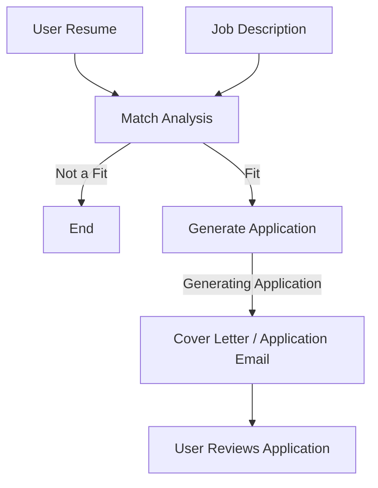

# AI Workflow

ApplyLint uses a multi-stage AI workflow to prepare a job application from a
candidate's experience and a specific job description.

The current MVP focuses on generating a targeted cover letter / email.

## Workflow

