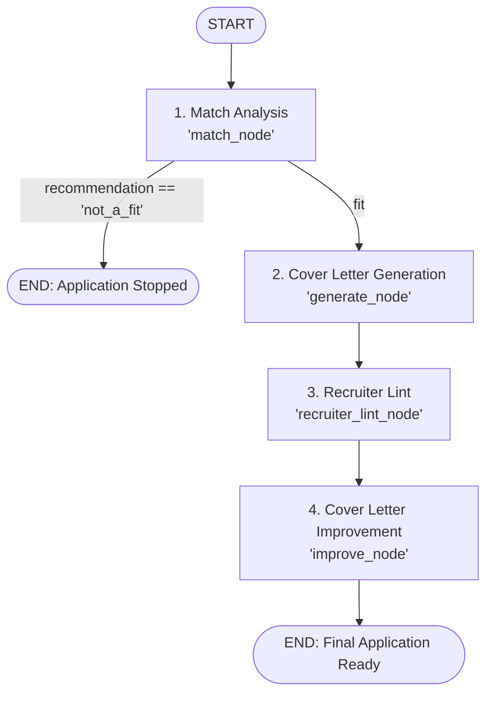

# AI Workflow

ApplyLint uses a multi-stage LangGraph workflow to evaluate candidate fit, generate an initial application, run adversarial linting, and produce a grounded, improved cover letter.

---

## 1. Workflow Architecture

The application pipeline is built as a stateful graph in [`backend/ai/workflows/application.py`](../backend/ai/workflows/application.py):

```text
Resume + Job Description
           ↓
     Match Analysis
      ↙          ↘
[not_a_fit]    [fit]
    ↓             ↓
   END      Cover Letter Generation
                  ↓
            Recruiter Lint
                  ↓
       Cover Letter Improvement
                  ↓
                 END
```



---

## 2. Pipeline Stages

The workflow runs in four stages:

### Stage 1: Match Analysis
* **Node:** `match_node` in [`backend/ai/nodes/match.py`](../backend/ai/nodes/match.py)
* **Documentation:** [Match Analysis](./match-analysis.md)
* **Details:** Evaluates the candidate's resume against the target job description. Scores technical skills, experience, education, and role alignment, and returns a recommendation (`strong_fit`, `potential_fit`, `weak_fit`, or `not_a_fit`).
* **Routing:** If the recommendation is `not_a_fit`, the workflow stops immediately at `END`. Otherwise, it proceeds to cover letter generation.

### Stage 2: Cover Letter Generation
* **Node:** `generate_node` in [`backend/ai/nodes/generate.py`](../backend/ai/nodes/generate.py)
* **Documentation:** [Cover Letter Generation](./cover-letter-gen.md)
* **Details:** Drafts an initial cover letter (subject and body) focused on two to three relevant candidate experiences prioritized by the Match Analysis.

### Stage 3: Recruiter Lint (Adversarial Check)
* **Node:** `recruiter_lint_node` in [`backend/ai/nodes/recruiter_lint.py`](../backend/ai/nodes/recruiter_lint.py)
* **Documentation:** [Recruiter Lint](./recruiter-lint.md)
* **Details:** Evaluates the generated cover letter against candidate data and the job description from the perspective of a critical technical recruiter. Emits structured findings across 32 canonical reason codes covering requirement gaps, grounding errors, timeline conflicts, and writing quality issues.

### Stage 4: Cover Letter Improvement
* **Node:** `improve_node` in [`backend/ai/nodes/generate.py`](../backend/ai/nodes/generate.py)
* **Documentation:** [Cover Letter Improvement](./cover-letter-improv.md)
* **Details:** Resolves findings from Recruiter Lint by restructuring text, removing ungrounded claims, or highlighting relevant transferable experience. Ensures every claim in the final letter is truthful and grounded in Candidate Data.

---

## 3. State Schema and Lifecycle

Workflow state uses `ApplicationState` defined in [`backend/ai/workflows/state.py`](../backend/ai/workflows/state.py):

```python
class ApplicationState(TypedDict):
    resume: dict[str, Any]
    job_description: str

    match_analysis: MatchAnalysis | None
    cover_letter: CoverLetter | None
    recruiter_lint: RecruiterLintResult | None
```

### Execution Flow
1. The workflow starts with `resume` and `job_description`.
2. As each node completes, state updates stream asynchronously to the client via `ApplyService.run_workflow()` in [`backend/services/apply_service.py`](../backend/services/apply_service.py).
3. The frontend displays progressive milestone updates across Match Analysis, Lint Findings, and the Final Cover Letter.
